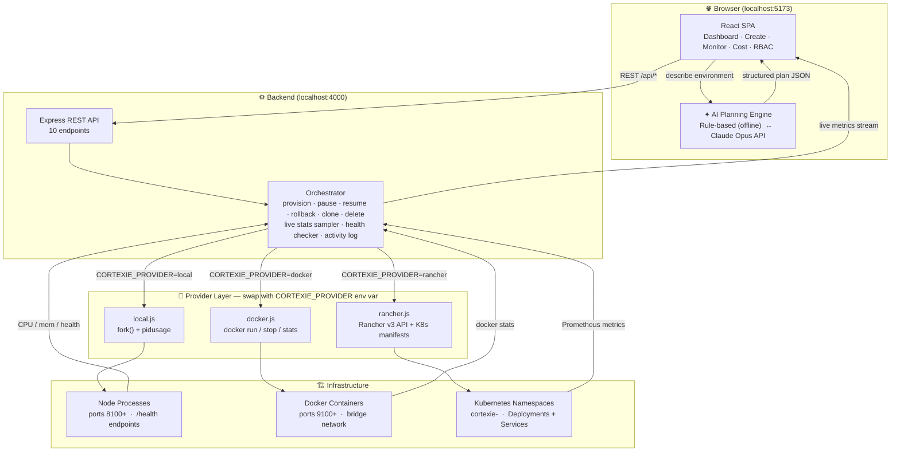
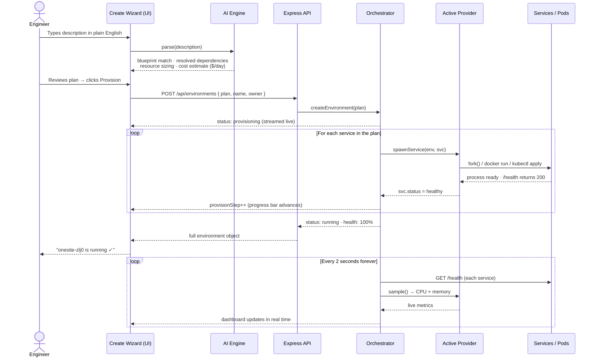
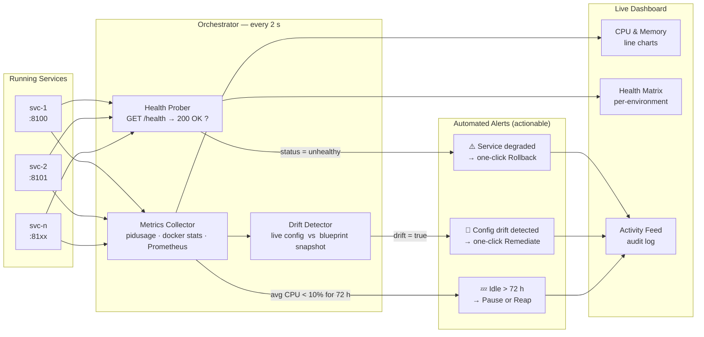
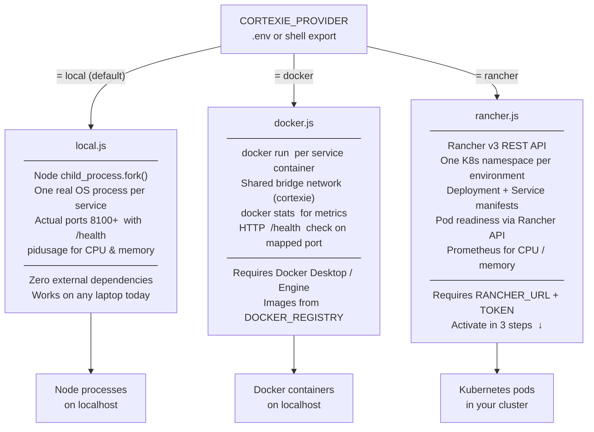

<div align="center">

# ✦ CortexIE

### AI-Powered Sandbox Orchestration for RealPage Integrated Environments

*From a plain-English description to a fully running, production-like environment — in under three minutes.*

---

[](https://nodejs.org)
[](https://react.dev)
[](https://vitejs.dev)
[](https://mui.com)
[](https://anthropic.com)
[](server/providers/)

</div>

---

## The problem we're solving

Every developer at RealPage has lived this story.

You need to test a hotfix, validate a new model, or demo a feature to a customer. You open a ticket. Infra responds in a day. The environment comes back wrong — wrong version, wrong config, missing a dependency. You reopen the ticket. Another day passes. By the time the environment is ready, the context is cold and the sprint has moved on.

> **The average sandbox setup at RealPage takes 2–3 days across manual infra work, back-and-forth tickets, and environment drift.**

CortexIE ends that cycle. Describe what you need in plain English. The AI engine resolves your dependencies, sizes your infrastructure, and hands you a production-like running environment — **in under three minutes, with zero infra tickets.**

---

## What it looks like in practice

```
You type:  "Full production-like OneSite environment with billing for a hotfix test in East US"

CortexIE:  Detected OneSite Property Management
           Matched blueprint → OneSite — Full Stack (Production-like)
           Resolved 4 dependencies: postgres@15, redis@7, auth-broker@2.3, prometheus@2.5
           Sized environment → 13 vCPU / 26 GB / 128 GB storage
           Estimated cost → $22.70/day

           [Provision] →  ✓ Parsing request & resolving dependencies
                          ✓ Generating Terraform plan (IaC)
                          ✓ Provisioning Kubernetes namespace & quotas
                          ✓ Deploying services & sidecars
                          ✓ Applying RBAC & network policies
                          ✓ Seeding data & running health checks

           Environment "onesite-zlj0" is running. Health: 100%
```

---

## How sandbox automation works

CortexIE follows a four-stage pipeline every time a sandbox is created.

### Stage 1 — Natural Language Intake

The engineer types a free-form description. CortexIE's AI planning engine reads the text and extracts intent: which RealPage product is needed, what scale (production-like vs. lightweight), what add-ons (observability, PII masking, data seeding), and what region.

The engine has two modes, switchable from the Settings page:

| Mode | How it works | When to use |
|---|---|---|
| **Rule-based** (default) | Keyword matching against a curated product catalogue. Offline, deterministic, zero external calls. Runs in <50 ms. | Demos, air-gapped environments, CI pipelines |
| **Claude API** | Sends the description to `claude-opus-4-8` with a strict JSON schema. Gets back a structured provisioning plan with reasoning. Falls back to rule-based on API failure. | When the request is nuanced or multi-product |

### Stage 2 — Dependency Resolution & Sizing

The matched blueprint carries a dependency graph. CortexIE walks the graph, pins each dependency to its required version (e.g. `postgres@15`, `redis@7`), and calculates the total vCPU/memory/storage footprint. A cost estimate ($/day) is computed before a single resource is touched.

### Stage 3 — Provisioning

The orchestrator iterates through the service list and calls the active **backend provider** for each one. There are three providers (see [Provider Architecture](#-provider-architecture) below):

- **Local** — forks a real Node.js process per service, each bound to a local port with a `/health` endpoint
- **Docker** — runs `docker run` for each service container on a shared bridge network
- **Rancher/Kubernetes** — posts a Deployment + Service manifest to the Rancher v3 API

Every step is streamed back to the UI in real time. The environment transitions: `provisioning → running`.

### Stage 4 — Continuous Monitoring

Once running, CortexIE polls every 2 seconds:
- **CPU & memory** per service (from `pidusage`, `docker stats`, or the Rancher metrics API)
- **Health checks** via `GET /health` on each service endpoint
- **Configuration drift** — detected when a live service configuration diverges from its provisioned blueprint snapshot

Drift, degraded services, and idle environments all surface as actionable alerts — not just notifications. Every alert has a one-click remediation button.

---

## Architecture

Four diagrams. One complete picture.

---

### 1 — System architecture

Every request travels from the browser through the AI engine, down to the Express API, into the orchestrator, and out to whichever infrastructure backend is active. Metrics and health data flow back the same path in real time.



---

### 2 — Sandbox creation pipeline

From the moment the engineer hits **Provision** to a fully running environment. Every step maps 1-to-1 to what you see in the UI wizard.



---

### 3 — Live monitoring & drift detection loop

Once an environment is running, the orchestrator continuously samples every service and surfaces problems as actionable alerts — not just passive notifications.



---

### 4 — Provider plug-in model

The orchestrator never calls infrastructure APIs directly. It always goes through the active provider. Switching is one environment variable — no code changes anywhere else.



---

## Provider architecture

The orchestrator is completely decoupled from the provisioning mechanism through a **provider interface**. Swapping providers is a single environment variable change — no code changes required.

```
┌─────────────────────────────────────────────────────────┐
│                    CortexIE Frontend                     │
│          (React · Vite · Material UI · Recharts)         │
└───────────────────────────┬─────────────────────────────┘
                            │ REST /api/*
┌───────────────────────────▼─────────────────────────────┐
│                Express API  (port 4000)                  │
└───────────────────────────┬─────────────────────────────┘
                            │
┌───────────────────────────▼─────────────────────────────┐
│                     Orchestrator                         │
│   createEnvironment · pause · resume · rollback · delete │
│   live stats sampler · health checker · activity log     │
└────────┬──────────────────┬──────────────────┬──────────┘
         │                  │                  │
         ▼                  ▼                  ▼
  ┌─────────────┐   ┌──────────────┐   ┌──────────────────┐
  │ local       │   │ docker       │   │ rancher          │
  │ provider    │   │ provider     │   │ provider         │
  │             │   │              │   │                  │
  │ fork()      │   │ docker run   │   │ Rancher v3 API   │
  │ pidusage    │   │ docker stats │   │ K8s Deployments  │
  │ SIGTERM     │   │ docker stop  │   │ Prometheus/OTEL  │
  └─────────────┘   └──────────────┘   └──────────────────┘
  Works today       Works with          Works with
  (no deps)         Docker Desktop      Rancher access
```

**Set `CORTEXIE_PROVIDER` in your `.env` to switch.** The orchestrator, the API, and the UI are identical across all three modes.

---

## What happens when Rancher access is granted

Right now, CortexIE runs on your laptop using real Node.js child processes — real ports, real `/health` endpoints, real CPU/memory metrics. **The full platform experience is already live.**

The Rancher provider ([server/providers/rancher.js](server/providers/rancher.js)) is fully written and waiting. Every step is already coded — namespace creation, Deployment manifests, Kubernetes Service creation, Prometheus metrics queries, Pod readiness checks. Each section is marked with a clear `// TODO:` comment showing exactly which field to fill in.

The moment you have Rancher credentials, activation is three steps:

**Step 1 — Add credentials to `.env`**
```bash
CORTEXIE_PROVIDER=rancher
RANCHER_URL=https://rancher.internal
RANCHER_TOKEN=token-xxxxx:xxxxxxxxxxxxxxxxxx
RANCHER_CLUSTER_ID=c-m-abcd1234
RANCHER_PROJECT_ID=c-m-abcd1234:p-xxxxx
RANCHER_IMAGE_REGISTRY=myregistry.io/cortexie
```

**Step 2 — Uncomment the API calls in `rancher.js`**

Each TODO block is a self-contained, copy-paste-ready Kubernetes manifest or Rancher API call. The namespace, labels, image names, and environment variables are already wired to the orchestrator's data model.

**Step 3 — Restart the server**
```bash
npm start
```

From that point, every sandbox creation in the UI provisions a real Kubernetes namespace in your cluster, deploys real workloads, and streams live pod metrics back to the monitoring dashboard — with zero changes to the frontend, the REST API, or the orchestrator logic.

---

## Tech stack

### Frontend

| Technology | Version | Role |
|---|---|---|
| **React** | 18 | Component model and rendering |
| **Vite** | 5 | Build tool and dev server (HMR, `/api` proxy) |
| **Material UI** | v5 | Full component library — dark "control center" theme (purple `#7c5cff` / teal `#19d3c5`) |
| **MUI X Data Grid** | v7 | Sortable, filterable environment tables |
| **Recharts** | 2 | Fleet health trends, CPU/memory line charts, cost breakdown bar charts, product distribution pie |
| **React Router** | v6 | Client-side routing across all pages |
| **@anthropic-ai/sdk** | latest | Optional Claude Opus integration for AI-backed planning |

### Backend

| Technology | Version | Role |
|---|---|---|
| **Node.js** | 18+ | Runtime (ES modules, native `fetch`) |
| **Express** | 4 | REST API server on port 4000 |
| **child_process.fork** | built-in | Spawns real OS processes per service (local provider) |
| **pidusage** | 3 | Samples live CPU/memory per process PID |
| **cors** | 2 | Cross-origin support for Vite dev proxy |

### Provider integrations

| Provider | Technology | Status |
|---|---|---|
| **Local** | Node `fork()` + `pidusage` | ✅ Active — works today |
| **Docker** | `docker` CLI via `child_process.exec` | ✅ Ready — set `CORTEXIE_PROVIDER=docker` |
| **Rancher/Kubernetes** | Rancher v3 REST API + K8s manifests | 🔜 Awaiting cluster credentials |

---

## Project structure

```
RealHack/
│
├── .env.example               ← Every config knob documented
├── vite.config.js             ← Vite + /api → :4000 proxy
├── package.json
│
├── server/                    ← Node/Express backend
│   ├── index.js               ← REST API (10 routes)
│   ├── orchestrator.js        ← Core lifecycle engine (provider-agnostic)
│   ├── service-runtime.js     ← Per-service HTTP process (/health + status page)
│   │
│   └── providers/             ← Pluggable backend drivers
│       ├── index.js           ← Factory: reads CORTEXIE_PROVIDER, exports driver
│       ├── local.js           ← fork() + pidusage  (default, no deps)
│       ├── docker.js          ← docker run/stop/stats
│       └── rancher.js         ← Rancher v3 API + K8s manifests  ← wire this up
│
└── src/                       ← React frontend
    ├── main.jsx               ← Entry + MUI theme + Router
    ├── App.jsx                ← Route definitions
    ├── theme.js               ← Dark theme tokens
    ├── ai/
    │   └── engine.js          ← AI planner: rule-based engine + Claude API path
    ├── api/
    │   └── client.js          ← REST client + relativeTime utility
    ├── components/
    │   ├── Layout.jsx         ← App shell: sidebar + top bar + activity feed
    │   ├── StatCard.jsx       ← KPI cards with trend indicators
    │   └── StatusChip.jsx     ← Colour-coded status badges
    ├── context/
    │   └── AppContext.jsx     ← Global state: environments, activities, actions
    ├── data/
    │   └── mockData.js        ← Products, blueprints, users, roles, storage classes
    └── pages/
        ├── Dashboard.jsx          ← Fleet health, recent envs, activity feed
        ├── CreateSandbox.jsx      ← 4-step wizard (the centrepiece)
        ├── Environments.jsx       ← List + filter all environments
        ├── EnvironmentDetail.jsx  ← Per-env stats, services, lifecycle ops
        ├── Templates.jsx          ← Blueprint gallery with one-click provision
        ├── Monitoring.jsx         ← Live health matrix, CPU/mem charts, alerts
        ├── CostOptimization.jsx   ← Spend tracking, idle detection, auto-cleanup
        ├── AccessControl.jsx      ← User & role management
        └── Settings.jsx           ← Provider toggle, API key, cleanup policy
```

---

## Blueprints (pre-built environment templates)

| Blueprint | Services | vCPU | Memory | Est. cost |
|---|---|---|---|---|
| **OneSite — Full Stack** | onesite-web, onesite-api, billing-svc, postgres, redis, data-seeder, otel-collector, grafana | 13 | 26 GB | $22.70/day |
| **AIRM — ML Pipeline** | airm-api, model-trainer, feature-store, postgres, mongo | 16 | 64 GB | $38.50/day |
| **LeaseStar — Lite** | leasestar-web, leasestar-api, postgres | 4 | 8 GB | $6.80/day |
| **Vendor Café — Integration** | vendorcafe-web, vendorcafe-api, postgres, redis | 6 | 12 GB | $9.90/day |
| **Resident Screening — Secure** | screening-api, pii-vault, postgres | 6 | 16 GB | $11.40/day |
| **Spend Management — Base** | spend-api, spend-ui, postgres | 4 | 8 GB | $8.10/day |

---

## Getting started

### Prerequisites

- **Node.js 18+** and **npm** — that's it for the local provider.
- Docker Desktop (optional, for `CORTEXIE_PROVIDER=docker`)
- Rancher cluster credentials (optional, for `CORTEXIE_PROVIDER=rancher`)

### Install

```bash
npm install
```

### Run (full stack — recommended)

```bash
npm start
```

Opens:
- **Frontend** → http://localhost:5173
- **Backend API** → http://localhost:4000

Vite automatically proxies `/api` → `localhost:4000`. No CORS or config changes needed.

### Other run modes

```bash
npm run dev      # Frontend only (mocked data, no backend needed)
npm run server   # Backend only (test the API directly)
npm run build    # Production build → dist/
npm run preview  # Preview the production build
```

---

## REST API reference

Base URL: `http://localhost:4000`

| Method | Endpoint | Description |
|---|---|---|
| `GET` | `/api/health` | Liveness check |
| `GET` | `/api/environments` | List all environments (sorted newest first) |
| `GET` | `/api/environments/:id` | Get a single environment with live metrics |
| `POST` | `/api/environments` | Provision a new environment from an AI plan |
| `POST` | `/api/environments/:id/clone` | Clone an existing environment |
| `POST` | `/api/environments/:id/pause` | Stop all services (preserves state) |
| `POST` | `/api/environments/:id/resume` | Restart all stopped services |
| `POST` | `/api/environments/:id/rollback` | Restore dead services to healthy baseline |
| `DELETE` | `/api/environments/:id` | Terminate and remove environment |
| `GET` | `/api/activities` | Recent activity log (last 40 events) |

**Provision request body:**
```json
{
  "plan": {
    "product": "onesite",
    "template": "tpl-onesite-full",
    "templateName": "OneSite — Full Stack",
    "region": "eastus2 (Azure)",
    "cpu": 13,
    "memoryGb": 26,
    "estCostPerDay": 22.7,
    "services": ["onesite-web", "onesite-api", "billing-svc", "postgres", "redis"]
  },
  "name": "onesite-hotfix-test",
  "owner": "Akshatha Reddy"
}
```

---

## Configuration reference

Copy `.env.example` to `.env` and fill in the values for your chosen provider.

```bash
# Provider selection
CORTEXIE_PROVIDER=local          # local | docker | rancher

# Docker
DOCKER_REGISTRY=myregistry.io/cortexie
DOCKER_NETWORK=cortexie
DOCKER_CONTAINER_PORT=8080

# Rancher / Kubernetes
RANCHER_URL=https://rancher.internal
RANCHER_TOKEN=token-xxxxx:xxxxxxxxxxxxxxxxxx
RANCHER_CLUSTER_ID=c-m-abcd1234
RANCHER_PROJECT_ID=c-m-abcd1234:p-xxxxx
RANCHER_NAMESPACE_PREFIX=cortexie-
RANCHER_IMAGE_REGISTRY=myregistry.io/cortexie
RANCHER_SKIP_TLS=false
```

---

## Optional: Claude AI planning engine

By default, CortexIE uses the offline rule-based engine — no API key, no external calls, fully deterministic.

To enable Claude-backed planning:

1. Open **Settings → AI configuration engine** and switch to **Claude API**.
2. Paste your Anthropic API key.
3. The Create Sandbox wizard now sends descriptions to `claude-opus-4-8`, receives a structured JSON provisioning plan, and falls back to rule-based if the API call fails.

> **Production note:** This prototype calls Claude directly from the browser for demo simplicity. In production, proxy the call through a backend service and never expose an API key client-side.

---

## Business impact

| Metric | Before CortexIE | With CortexIE |
|---|---|---|
| Time to provision a sandbox | 2–3 days | < 3 minutes |
| Infrastructure knowledge required | Deep (Terraform, K8s, Helm) | None (plain English) |
| Environment consistency | Variable — manual drift common | Enforced via versioned blueprints |
| Cost visibility | None | Per-environment $/day, projected monthly |
| Idle resource waste | Invisible | Detected automatically, one-click reap |
| Self-service access | Engineers only | Any role, governed by RBAC |

---

## Roadmap to production

The prototype is architecturally production-ready. The path to a fully live deployment is:

1. **Wire Rancher credentials** → real K8s namespaces replace local processes (no code changes, just `.env`)
2. **Publish service images** to your registry → Docker/Rancher providers pull them automatically
3. **Connect your Helm chart registry** → replace the inline Deployment manifests in `rancher.js` with Helm app installs
4. **Add persistent state** → swap the in-memory environment registry for a Postgres-backed store
5. **Proxy the Claude API key** → move the AI call from browser to a server-side route
6. **Wire SSO** → integrate RealPage identity provider into the RBAC layer

Steps 1 and 2 unlock the full Kubernetes experience. The rest is hardening for production load.

---

<div align="center">

**Built at RealHack in 24 hours.**
*CortexIE — because the environment should be as intelligent as the engineers building on top of it.*

</div>
